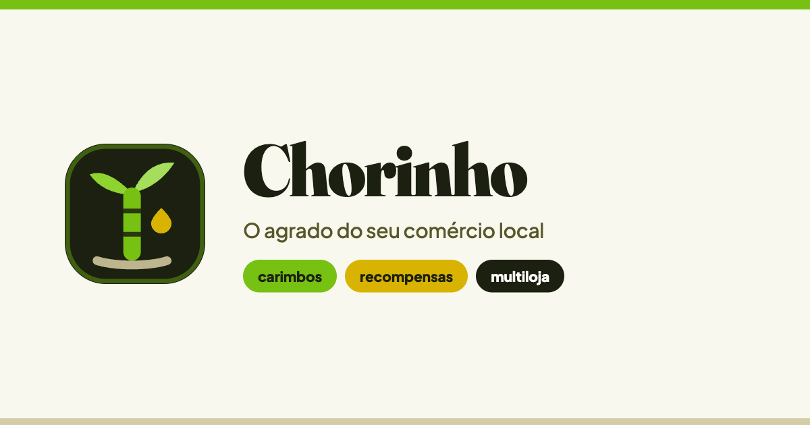

# Chorinho

**Chorinho** é a digitalização daquele agrado que só o comércio de bairro sabe dar: a fatia extra de bolo na padaria, o refil de café no coador, a toalha quente na barbearia.

É um programa de fidelidade **compartilhado entre lojas**: o caixa escaneia o cliente, informa o valor da venda, e os selos são creditados automaticamente pelas regras daquele comerciante. Selos viram desconto, produto e NFTs exclusivas do estabelecimento — e tudo fica registrado on-chain.

O cliente não precisa saber que existe blockchain por trás. Entra com e-mail ou Google e pronto.

---

## Rodando na sua máquina

**Pré-requisitos:** [Bun](https://bun.sh) 1.3+, [Foundry](https://getfoundry.sh) e [Git](https://git-scm.com).

```bash
bun install
bun dev
```

É só isso. O `bun dev` sobe as três coisas de uma vez: a blockchain local (Anvil), o deploy dos contratos e o frontend.

| Serviço | Endereço |
| :--- | :--- |
| Aplicação | http://localhost:3000 |
| Blockchain local (Anvil) | http://localhost:8545 |

Quer os passos separados, cada um no seu terminal?

```bash
bun chain      # blockchain local
bun deploy     # deploy dos contratos (gera os tipos do frontend)
bun start      # frontend
```

Para popular a vitrine com campanhas de exemplo: `bun seed`.

---

## Comandos

| Comando | O que faz |
| :--- | :--- |
| `bun dev` | Sobe tudo: blockchain, deploy e frontend |
| `bun run test` | Roda os testes dos contratos |
| `bun compile` | Compila os contratos |
| `bun deploy` | Faz o deploy e regenera os tipos do frontend |
| `bun seed` | Cria campanhas de exemplo na blockchain local |
| `bun lint` | Verifica contratos e frontend |
| `bun format` | Formata contratos e frontend |
| `bun next:build` | Build de produção do frontend |
| `bun account` | Mostra a conta usada nos deploys |
| `bun generate` | Cria uma conta nova de deploy |
| `bun account:import` | Importa uma chave privada existente |
| `bun deploy --network base-sepolia` | Deploy numa rede de verdade |
| `bun verify --network base-sepolia` | Verifica os contratos no explorador |

---

## As seis experiências

O aplicativo é um só, dividido em seis experiências ("flavors"). Cada uma tem
navegação e tema próprios, sobre a mesma paleta da marca.

| Flavor | Rotas | Para quem |
| :--- | :--- | :--- |
| **SPA** | `/`, `/como-funciona`, `/para-comerciantes`, `/ajuda` | Visitante — site e aquisição |
| **Privacidade** | `/privacidade`, `/termos`, `/carteira-e-seguranca`, `/cookies` | Quem quer ler as regras |
| **Cliente** | `/mapa`, `/explorar`, `/carteira`, `/passe`, `/recompensas`, `/perfil`, `/campanha/[id]` | Quem compra no bairro |
| **Comerciante** | `/painel`, `/cadastro` | Dono da loja |
| **PDV** | `/pdv` | Atendente no balcão |
| **Admin** | `/admin` | Nossa equipe |
| **Dev** | `/debug`, `/blockexplorer` | Ferramentas do Scaffold-ETH |

Cada flavor vive num route group em `packages/nextjs/app/` — `(site)`, `(legal)`,
`(app)`, `(merchant)`, `(pos)`, `(admin)` e `(dev)` — com layout, navegação e par
de temas próprios.

> Algumas telas ainda são marcadores honestos que dizem em qual etapa o conteúdo
> chega. O mapa, o PWA e a autenticação estão no roadmap abaixo.

---

## Contratos

Em `packages/foundry/contracts/`:

| Contrato | O que faz |
| :--- | :--- |
| `EstablishmentRegistry` | Diretório de lojas parceiras e permissões da plataforma |
| `DiscountNFT` | Campanhas e cupons (ERC-1155), com resgate no balcão |
| `BonusNFT` | Selo de conquista intransferível, cunhado ao completar uma trilha |

Rode `bun run test` para os testes (precisa do `run`: `test` é um comando embutido do Bun). Depois de `bun deploy`, os tipos aparecem sozinhos em `packages/nextjs/contracts/deployedContracts.ts` — **nunca edite esse arquivo à mão.**

---

## Variáveis de ambiente

Nenhuma é obrigatória para rodar localmente — o projeto sobe com chaves públicas de demonstração.

**`packages/nextjs/.env.local`**

| Variável | Para quê |
| :--- | :--- |
| `NEXT_PUBLIC_ALCHEMY_API_KEY` | RPC próprio em redes públicas |
| `NEXT_PUBLIC_WALLET_CONNECT_PROJECT_ID` | Conectar carteiras via WalletConnect |

**`packages/foundry/.env`**

| Variável | Para quê |
| :--- | :--- |
| `ALCHEMY_API_KEY` | Deploy em redes públicas |
| `ETHERSCAN_API_KEY` | Verificar contratos no explorador |

> Nunca versione um `.env`. O `.gitignore` já bloqueia todos eles.

---

## Como o lojista paga

**Ainda não está decidido** — e isso é de propósito. A cobrança fica atrás de uma interface única (`BillingProvider`), com cinco caminhos pré-engatilhados. Trocar de gateway é trocar uma variável, não refazer código.

```bash
BILLING_PROVIDER=manual        # padrão — admin ativa a loja à mão, sem gateway
BILLING_PROVIDER=stripe        # cartão nacional e internacional, com portal de autoatendimento
BILLING_PROVIDER=mercadopago   # cartão, Pix, boleto e saldo MP — o lojista já tem conta
BILLING_PROVIDER=asaas         # Pix, boleto e cartão, com régua de inadimplência inclusa
BILLING_PROVIDER=pix           # Pix Automático (Banco Central) — custo por transação quase zero
BILLING_PROVIDER=crypto        # USDC na Base — liquidação instantânea, sem chargeback
```

| Opção | Meios | Recorrência | Ponto forte | Ponto fraco |
| :--- | :--- | :--- | :--- | :--- |
| **Stripe** | Cartão | Nativa | Único com portal pronto para o lojista | Taxa mais alta no Brasil |
| **Mercado Pago** | Cartão, Pix, boleto | Nativa | O lojista já conhece e confia | API de assinatura mais rústica |
| **Asaas** | Pix, boleto, cartão | Nativa | Feito para PME brasileira, taxa baixa | Menos conhecido fora do Brasil |
| **Pix Automático** | Pix | Nativa | Custo quase zero por cobrança | Exige PSP habilitado |
| **USDC (Base)** | Stablecoin | Própria | Instantâneo e sem chargeback | Exige que o lojista tenha cripto |

Até a escolha ser feita, o admin ativa lojas manualmente — nada no produto fica bloqueado por essa decisão.

---

## Branches

| Branch | Para quê |
| :--- | :--- |
| `main` | Produção. Só entra por PR com CI verde |
| `dev` | Integração. É para cá que vão os PRs do dia a dia |
| `testes` | QA com dados de exemplo. Pode forçar push à vontade |
| `ci` | Sandbox para mexer no pipeline sem queimar run de PR |

---

## Roadmap

O plano completo — contratos de selos e pontos, as seis experiências, mapa, PWA offline no balcão e cobrança — está descrito em detalhe no plano de implementação do projeto.

## Documentação do projeto

- [`DESIGN_SYSTEM.md`](./DESIGN_SYSTEM.md) — identidade visual, tipografia, cores e componentes
- [`AGENTS.md`](./AGENTS.md) — convenções de código e instruções para agentes

---

Construído sobre [Scaffold-ETH 2](https://docs.scaffoldeth.io).
